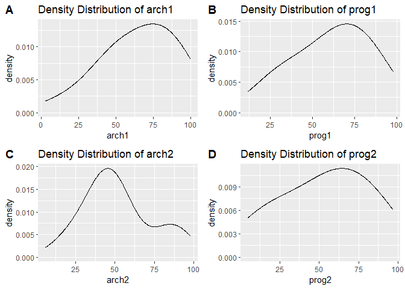
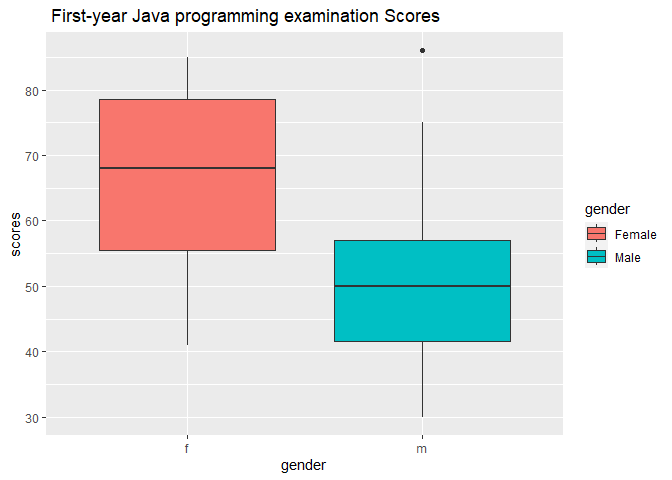

Formative_Assessment_1_Ramilo
================
Zion John Yousef T. Ramilo
2024-01-22

## Question 1:

Write the **skewness program**, and use it to calculate the skewness
coefficient of the four examination subjects.

a.) What can you say about these data? b.) Pearson has given an
approximate formula for the skewness, Is it a reasonable approximation?

``` r
for (i in 2:5){
  col_values <- na.exclude(df[[i]])
  col_mean <- mean(col_values)
  col_median <- median(col_values)
  std_dev <- describe(col_values)$sd
  
  difference_arr <- c()
  for (val in col_values){
    ans <- (val - col_mean)^3
    difference_arr <- append(difference_arr,ans)
  }
  
  pearson_approx = 3*((col_mean - col_median) / std_dev)
  
  summation_x_xi = sum(difference_arr)
  size_arr = length(col_values)
  
  
  skewness_ = summation_x_xi / ((size_arr - 1) * (std_dev^3))
  cat("Subject:",colnames(df)[i],", Skewness: ",skewness_,", Pearson: ",pearson_approx,", Error %: ",(abs((skewness_-pearson_approx)/pearson_approx))*100,"\n")
}
```

    ## Subject: arch1 , Skewness:  -0.5107305 , Pearson:  -0.6069042 , Error %:  15.84661 
    ## Subject: prog1 , Skewness:  -0.3319986 , Pearson:  -0.643229 , Error %:  48.38563 
    ## Subject: arch2 , Skewness:  0.4462073 , Pearson:  0.5421286 , Error %:  17.69346 
    ## Subject: prog2 , Skewness:  -0.3004643 , Pearson:  -0.3562908 , Error %:  15.66881

a.) The Data shows that for the exam scores for arch1,prog1, and prog2
it is skewed to the left indicates that more students are scored high
percentiles and has a communicates a moderate amount of skewness, whilst
the exam scores for arch2 shows moderate amount of skewness to the right
indicating lower scores from the students. These interpretations is
supported by the figures below that showcases the density distributions
of each exam scores.

``` r
df_none_na <- na.omit(df)
figA <- ggplot(df_none_na, aes(x = arch1))+
  geom_density(adjust = 2)+
  labs(title = 'Density Distribution of arch1')
figB <- ggplot(df_none_na, aes(x = prog1))+
  geom_density(adjust = 2)+
  labs(title = 'Density Distribution of prog1')

figC <-ggplot(df_none_na, aes(x = arch2))+
  geom_density(adjust = 2)+
  labs(title = 'Density Distribution of arch2')
figD <-ggplot(df_none_na, aes(x = prog2))+
  geom_density(adjust = 2)+
  labs(title = 'Density Distribution of prog2')

ggarrange(figA,figB,figC,figD,
          ncol = 2,nrow = 2,align = ("v"), 
          labels = c("A ", "B ", "C ", "D "))
```

<!-- -->

b.) Pearson’s approximation does tell us the direction of where the
skewness is however the degree of skewness are to be debated upon,
within the percentage of errors some are below 20% and there is those
that has above 40% and this can be really be difficult when we are
dealing with very small decimals such as 0.03 as the skewness and if we
can’t get an accurate representation of skewness we cannot tell whenever
we can say our distribution is approximately normal or not.

## Question 2:

For the class of 50 students of computing detailed in Exercise 1.1, use
R to:

a.) form the stem-and-leaf display for each gender, and discuss the
advantages of this representation compared to the traditional histogram
b.) construct a box-plot for each gender and discuss the findings.

``` r
gender_scores <- read.csv("C:/Users/acer/Downloads/Gender_Scores - Sheet1.csv")

group_data <- gender_scores %>% 
 group_by(gender) %>% 
group_split()

female_data <- group_data[[1]]
male_data <- group_data[[2]]
print("Stem-n-Leaf for Female Scores")
```

    ## [1] "Stem-n-Leaf for Female Scores"

``` r
stem(female_data[[2]])
```

    ## 
    ##   The decimal point is 1 digit(s) to the right of the |
    ## 
    ##   4 | 1348
    ##   5 | 15679
    ##   6 | 058
    ##   7 | 155889
    ##   8 | 01335

``` r
print("Stem-n-Leaf for Male Scores")
```

    ## [1] "Stem-n-Leaf for Male Scores"

``` r
stem(male_data[[2]])
```

    ## 
    ##   The decimal point is 1 digit(s) to the right of the |
    ## 
    ##   3 | 001257
    ##   4 | 1224899
    ##   5 | 01113668
    ##   6 | 4457
    ##   7 | 5
    ##   8 | 6

a.) Generally we use a stem and leaf plot in order to observe and
analyze individual data points and get an idea of the distribution of
our data set, it is very helpful for smaller samples of data, in
addition using a stem and leaf plot helps us identify potential outliers
that our traditional histogram cannot communicate.

``` r
gender_scores %>%
  ggplot(aes(x = gender, y = scores, fill = gender)) +
  geom_boxplot()+
  labs(title = " First-year Java programming examination Scores")+
  scale_fill_discrete(labels = c("Female", "Male"))
```

<!-- -->

b.) Within the box plot we can see that on average the female group will
be greater than the male group in terms of examination scores, the box
plot also tells us the the inter quantiles of the men and women are
different in terms of with or spread. Typically a student from the
female group can get about a 75%, whilst typically the male group can
get about 50% this denoted through thier medians. Within the male group
the plot showed an outlier with a point of 86%. Within the test the
female group has a maximum of about 85% and a minimum of about 40%
whilst the male group has a maximum of about 75% and a minimum of about
30%.
