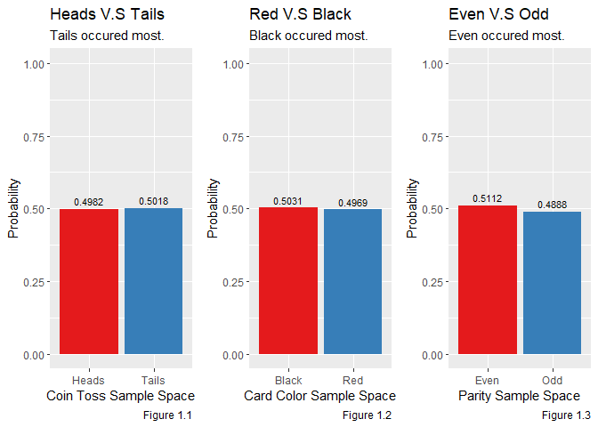
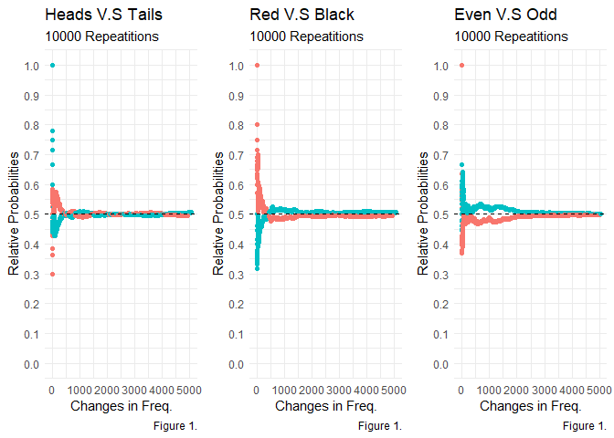
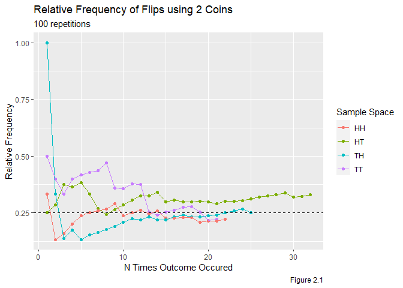
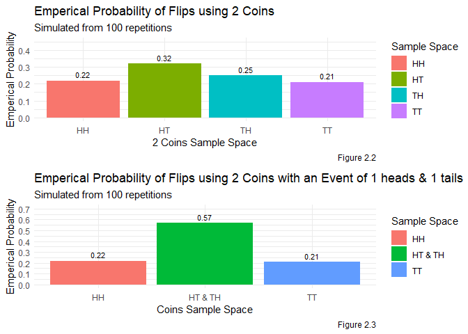
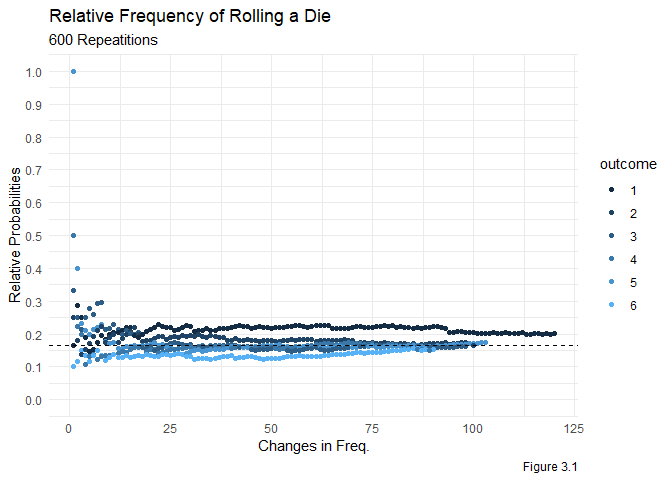

Formative Assessment 2 Ramilo
================
Zion John Yousef T. Ramilo
2024-02-08

# 0.5 Probabilities

- Use R to illustrate that the probability of getting:
  - a head is 0.5 if a fair coin is tossed repeatedly;
  - a red card is 0.5 if cards are drawn repeatedly with replacement
    from a well-shuffled deck;
  - an even number is 0.5 if a fair die is rolled repeatedly.

``` r
outcomes_fair_coin <- data.frame(coins_tossed = sample(c("Heads","Tails"),10000,replace = TRUE)) %>% 
  group_by(coins_tossed) %>% 
    summarize(probability = n() / 10000)

outcomes_cards <- data.frame(card_picked_colors = sample(c("Red","Black"),10000,replace = TRUE)) %>% 
  group_by(card_picked_colors) %>% 
    summarize(probability = n() / 10000)

outcomes_nums <- data.frame(numbers_parity = sample(c("Even","Odd"),10000,replace = TRUE)) %>% 
  group_by(numbers_parity) %>% 
    summarize(probability = n() / 10000)

fair_coin <- ggplot(outcomes_fair_coin,mapping = aes(x = coins_tossed,y=probability,fill = coins_tossed,label = probability))+
    geom_col()+
      geom_text(size = 3, vjust = -0.5)+
        scale_y_continuous(limits = c(0,1),n.breaks = 5)+
            scale_fill_brewer(palette = "Set1")+
              xlab("Coin Toss Sample Space")+
                ylab("Probability")+
                  labs(title = "Heads V.S Tails",
                       caption = "Figure 1.1",
                        subtitle = paste(outcomes_fair_coin$coins_tossed[which.max(outcomes_fair_coin$probability)],"occured most."),fill = "Sample Space")+guides(fill = "none")

red_black_cards <- ggplot(outcomes_cards,mapping = aes(x = card_picked_colors,y=probability,fill = card_picked_colors,label = probability))+
    geom_col()+
      geom_text(size = 3, vjust = -0.5)+
        scale_y_continuous(limits = c(0,1),n.breaks = 5)+
            scale_fill_brewer(palette = "Set1")+
              xlab("Card Color Sample Space")+
                ylab("Probability")+
                  labs(title = "Red V.S Black",
                       caption = "Figure 1.2",
                        subtitle = paste(outcomes_cards$card_picked_colors[which.max(outcomes_cards$probability)],"occured most."),fill = "Sample Space")+guides(fill = "none")

even_odd_nums <- ggplot(outcomes_nums,mapping = aes(x = numbers_parity,y=probability,fill = numbers_parity,label = probability))+
    geom_col()+
      geom_text(size = 3, vjust = -0.5)+
        scale_y_continuous(limits = c(0,1),n.breaks = 5)+
            scale_fill_brewer(palette = "Set1")+
              xlab("Parity Sample Space")+
                ylab("Probability")+
                  labs(title = "Even V.S Odd",
                       caption = "Figure 1.3",
                        subtitle = paste(outcomes_nums$numbers_parity[which.max(outcomes_nums$probability)],"occured most."),fill = "Sample Space")+guides(fill = "none")

# >> "From repeated trials of 10,000"
ggarrange(fair_coin,red_black_cards,even_odd_nums,ncol = 3,nrow = 1,align = ("h"))
```

<!-- -->

``` r
simulate_exp <- function(lists,n_rep,caption = "Figure 1."){
  graphs <- list()
  sample_spaces <- lists
  data_frames <- list()
  for (space in sample_spaces) {
    
    if(length(sample_spaces) == 1){
      title_graph <- "Relative Frequency of Rolling a Die"
      guides_show <- "legend"
    }else{
      title_graph <- paste(space[1],"V.S",space[2])
      guides_show <- "none"
    }
    
    all_outcomes<-c()
    all_probabilities <- c()
    chosen_occured <- c()
    for(i in 1:n_rep){
      chosen_outcome <- sample(space,1)
      all_outcomes <- c(all_outcomes,chosen_outcome)
      sum_chosen_outcome <- sum(all_outcomes == chosen_outcome)
      relative_freq <- sum_chosen_outcome / length(all_outcomes)
      all_probabilities <- c(all_probabilities,relative_freq)
      chosen_occured <- c(chosen_occured,sum_chosen_outcome)
    }
    data_frame_temp <- data.frame(outcome = all_outcomes,relative_probabilities = all_probabilities,occurances = chosen_occured)
    plt<- ggplot(data_frame_temp, aes(x =occurances , y = relative_probabilities,colour = outcome)) +
      geom_point() +
      labs(title=title_graph,x = "Changes in Freq.", y = "Relative Probabilities",
           caption = caption,
           subtitle = paste(n_rep,"Repeatitions")) +
      theme_minimal()+
      scale_y_continuous(limits = c(0,1),n.breaks = 10)+
      guides(colour = guides_show)+
      geom_hline(yintercept = (1/length(space)),linetype = "dashed", color = "black")
    graphs <- c(graphs, list(plt))
    data_frames <- c(data_frames,data_frame_temp)
  }
  return(list(graphs = graphs, data_frames = data_frames))
}
sample_spaces_possible <- list(
  c("Heads","Tails"),
  c("Red","Black"),
  c("Even","Odd")
)
suppressWarnings({
  simulated<- simulate_exp(sample_spaces_possible,10000)$graphs
  ggarrange(simulated[[1]],simulated[[2]],simulated[[3]],ncol = 3,nrow = 1,align = ("v"))
})
```

<!-- -->

As we can observe within the 3 graphs wherein their sample spaces are
equal to 2 converge to 0.5 whenever the repetitions reached infinity,
within these illustrations we have conducted the simulations under
10,000 repetitions.

# Flip 2 Coins

- An experiment consists of tossing two fair coins. Use R to simulate
  this experiment 100 times and obtain the relative frequency of each
  possible outcome. Hence, estimate the probability of getting one head
  and one tail in any order.

``` r
library(tidyverse)
coins_2_rel_freq <- function(sample_space,n_rep) {
  
  relative_freq_each <- c()
  coin_outcomes <- c()
  n_times_outcome_occured <- c()
  
  for (i in 1:n_rep) {
    coin_is_flipped <- sample(sample_space,1)
    
    coin_outcomes <- c(coin_outcomes,coin_is_flipped)
    rel_freq <- sum(coin_outcomes == coin_is_flipped) / length(coin_outcomes)
    
    relative_freq_each <- c(relative_freq_each,rel_freq)
    n_times_outcome_occured <- c(n_times_outcome_occured,sum(coin_outcomes == coin_is_flipped))
  }
  coins_data_frame <- data.frame(coin_outcomes = coin_outcomes,
                                 relative_freq_each = relative_freq_each,
                                 n_times_outcome_occured = n_times_outcome_occured)
  coins_data_graph <- ggplot(coins_data_frame,aes(x = n_times_outcome_occured,
                              y = relative_freq_each,
                              color = coin_outcomes))+
    geom_point()+
    geom_line()+
    geom_hline(yintercept = 1/length(sample_space),
               linetype = "dashed",
               color = "black")+
    labs(
      title = "Relative Frequency of Flips using 2 Coins",
      caption = "Figure 2.1",
      subtitle = paste(n_rep,"repetitions"),
      x = "N Times Outcome Occured",
      y = "Relative Frequency",
      color = "Sample Space"
    )
  return_df_n_graph <- list(coins_data_graph = coins_data_graph,
                            coins_data_frame = coins_data_frame)
  return(return_df_n_graph)
}
two_coins <- c(
  "HH","HT","TH","TT"
)
repet<- 100
returned_values <- coins_2_rel_freq(two_coins,repet)
returned_values[[1]]
```

<!-- -->

``` r
df_outcomes_all <- data.frame(coins_flip = returned_values[[2]]$coin_outcomes) %>% 
  group_by(coins_flip) %>% 
  summarize(emperical_probability = n()/repet)
two_coins_1 <- ggplot(df_outcomes_all,aes(x = coins_flip,
                           y = emperical_probability,
                           fill = coins_flip,
                           label = emperical_probability))+
  geom_col()+
  theme_minimal()+
  geom_text(size = 3, vjust = -0.5)+
  scale_y_continuous(limits = c(0,0.45),n.breaks = 8)+
  labs(
    title = "Emperical Probability of Flips using 2 Coins",
    caption = "Figure 2.2",
    subtitle = paste("Simulated from",repet,"repetitions"),
    x = "2 Coins Sample Space",
    y = "Emperical Probability",
    fill = "Sample Space"
  )
  

events <- c("HH","HT & TH", "TT")
emperic_prob <- c(
  sum(returned_values[[2]]$coin_outcomes == "HH") / repet,
  (sum(returned_values[[2]]$coin_outcomes == "HT") + sum(returned_values[[2]]$coin_outcomes == "TH"))/ repet,
  sum(returned_values[[2]]$coin_outcomes == "TT") / repet
)
df_event_1h_1t <- data.frame(
  events = events,
  emperic_prob = emperic_prob
)
two_coins_2 <- ggplot(df_event_1h_1t,aes(x = events,
                           y = emperic_prob,
                           fill = events,
                           label = emperic_prob))+
  geom_col()+
  theme_minimal()+
  geom_text(size = 3, vjust = -0.5)+
  scale_y_continuous(limits = c(0,0.7),n.breaks = 8)+
  labs(
    title = "Emperical Probability of Flips using 2 Coins with an Event of 1 heads & 1 tails",
    subtitle = paste("Simulated from",repet,"repetitions"),
    caption = "Figure 2.3",
    x = "Coins Sample Space",
    y = "Emperical Probability",
    fill = "Sample Space"
  )
ggarrange(two_coins_1,two_coins_2,ncol = 1,nrow = 2,align = ("v"))
```

<!-- -->

``` r
head(df_outcomes_all)
```

    ## # A tibble: 4 × 2
    ##   coins_flip emperical_probability
    ##   <chr>                      <dbl>
    ## 1 HH                          0.22
    ## 2 HT                          0.32
    ## 3 TH                          0.25
    ## 4 TT                          0.21

``` r
tail(df_outcomes_all)
```

    ## # A tibble: 4 × 2
    ##   coins_flip emperical_probability
    ##   <chr>                      <dbl>
    ## 1 HH                          0.22
    ## 2 HT                          0.32
    ## 3 TH                          0.25
    ## 4 TT                          0.21

Figure 2.1 shows the relative frequency of each outcome as there are
more repetitions and we can observe within this figure it becomes
apparent that the sample spaces are converging at 0.25. For the overall
empirical probabilities of each outcome we can observe Figure 2.2.
Figure 2.3 shows us the overall empirical probabilities with a condition
such that it shows 1 head and 1 tail, within Figure 2.3 we can observe
since the event covers 2 outcomes therefore it has an estimated
probability is about 0.5. in addition the empirical probabilities of
each outcome from Figure 2.2 shows that when we combine or to say add
their probabilities we can approximately reach the empirical probability
of the even within Figure 2.3 with high accuracy since “HT” and “TH” are
both independent from each other.

# Roling a Die

- An experiment consists of rolling a die. Use R to simulate this
  experiment 600 times and obtain the relative frequency of each
  possible outcome. Hence, estimate the probability of getting each of
  1, 2, 3, 4, 5, and 6.

``` r
suppressWarnings({
  sample_spaces_possible = list(c(1:6))
  returns_<- simulate_exp(sample_spaces_possible,600,caption = "Figure 3.1")
  returned_plot <- returns_$graphs
  returned_frame <- returns_$data_frames$outcome
  dataframe_rolled <- data.frame(dice_rolled = returns_$data_frames$outcome,
                          relative_freq = returns_$data_frames$relative_probabilities,
                          current_n_outcomes = returns_$data_frames$occurances)
  returned_plot[[1]]
})
```

<!-- -->

``` r
head(dataframe_rolled)
```

    ##   dice_rolled relative_freq current_n_outcomes
    ## 1           5     1.0000000                  1
    ## 2           4     0.5000000                  1
    ## 3           3     0.3333333                  1
    ## 4           2     0.2500000                  1
    ## 5           5     0.4000000                  2
    ## 6           1     0.1666667                  1

``` r
tail(dataframe_rolled)
```

    ##     dice_rolled relative_freq current_n_outcomes
    ## 595           1     0.2000000                119
    ## 596           4     0.1493289                 89
    ## 597           1     0.2010050                120
    ## 598           3     0.1622074                 97
    ## 599           3     0.1636060                 98
    ## 600           2     0.1666667                100

``` r
df_roll_die <- data.frame(rolled_dice = returned_frame) %>% 
  group_by(rolled_dice) %>% 
    summarize(estimated_probability = round(n() / length(returned_frame),4))
ggplot(data = df_roll_die,mapping = aes(x = rolled_dice,y = estimated_probability,fill = rolled_dice,label = estimated_probability))+
  geom_col()+
  scale_x_continuous(n.breaks = 6)+
  scale_y_continuous(limits = c(0,0.3),n.breaks = 10)+
  geom_text(size = 3, vjust = -0.5)+
  labs(title="Emperical Probaiblities of a Rolled Die",
       x = "Die Sample Space", 
       y = "Estimated Probabilities",
       subtitle = "Simulated through 600 repetitions",
       caption = "Figure 3.2",
       fill = "Sample Space") +
  theme_minimal()
```

<!-- -->

Within our simulation Figure 3.1 shows that the probability of each
outcome is converging towards 0.17 with 600 repetitions and within
Figure 3.2 shows the the simulations approximately models after the
uniform distribution, though there are instances that some numbers
occured than others.

# Amy v.s. Jane

- Amy and Jane are gambling together. A fair coin is tossed repeatedly.
  Each time a head comes up, Amy wins two euro from Jane, and each time
  a tail comes up, Amy loses two euro to Jane. Use R to simulate this
  game 100 times, and estimate:
  - the number of times that Amy is ahead in these 100 tosses;
  - how much Amy has won or lost after 100 tosses.

``` r
person_ahead <- c()
current_tosses <- c()
rounds <- c()
for(i in 1:100){
  sample_space <- c("H","T")
  flipped <- sample(sample_space,1)
  current_tosses <- c(current_tosses,flipped)
  current_winner <- "Jane"
  sum_H <- sum(current_tosses == "H")
  sum_T <- sum(current_tosses == "T")
  if(sum_H > sum_T){
    current_winner <- "Amy"
  }else if (sum_H == sum_T){
    current_winner <- NA
  }else{
    current_winner <- "Jane"
  }
  if(flipped == "H"){
    rounds <- c(rounds,"Amy")
  }else{
    rounds <- c(rounds,"Jane")
  }
  person_ahead <- c(person_ahead,current_winner)
}
euros <- sum(current_tosses == "H")*2-sum(current_tosses == "T")*2
amy_ahead <- sum(person_ahead == "Amy",na.rm = TRUE)

n_h <- paste("N times the coin faced Heads:",sum(current_tosses == "H"))
n_t <- paste("N times the coin faced Tails:",sum(current_tosses == "T"))

amy_first <- paste("N times that Amy is ahead:",amy_ahead)
if(amy_ahead < 0 ){
  euro_s <- paste("Amy lost a total of",abs(euros),"euros")
}else{
  euro_s <- paste("Amy gained a total of",abs(euros),"euros")
}
amy_vs_jane_df <- data.frame(coin_flip = current_tosses,
                             round_won_by = rounds,
                             person_ahead = person_ahead)
cat("\n",n_h,"\n",n_t,"\n",amy_first,"\n",euro_s)
```

    ## 
    ##  N times the coin faced Heads: 51 
    ##  N times the coin faced Tails: 49 
    ##  N times that Amy is ahead: 29 
    ##  Amy gained a total of 4 euros

``` r
head(amy_vs_jane_df)
```

    ##   coin_flip round_won_by person_ahead
    ## 1         T         Jane         Jane
    ## 2         H          Amy         <NA>
    ## 3         T         Jane         Jane
    ## 4         H          Amy         <NA>
    ## 5         H          Amy          Amy
    ## 6         T         Jane         <NA>

``` r
tail(amy_vs_jane_df)
```

    ##     coin_flip round_won_by person_ahead
    ## 95          T         Jane          Amy
    ## 96          H          Amy          Amy
    ## 97          T         Jane          Amy
    ## 98          H          Amy          Amy
    ## 99          T         Jane          Amy
    ## 100         H          Amy          Amy
