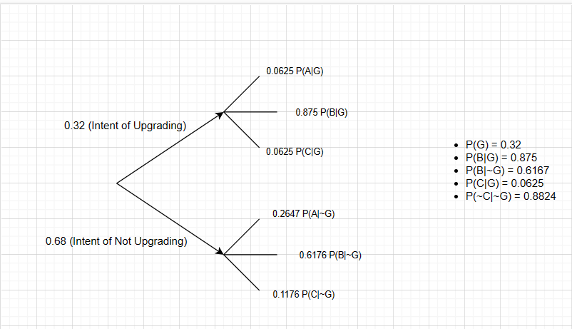

Formative Assessment 5
================
Ramilo, Zion John Yousef T.
2024-03-07

An email message can travel through one of three server routes. The
percentage of errors in each of the servers and the percentage of
messages that travel each route are shown in the following table. Assume
that the servers are independent.

``` r
head(df_messages_server)
```

    ##    servers Percentage_of_Messages Percentage_of_Errors
    ## 1 Server 1                   0.40                0.010
    ## 2 Server 2                   0.25                0.020
    ## 3 Server 3                   0.35                0.015

Determine the percentage of emails that contain an error. $$
\begin{aligned}
\text{P}(\text{Errors}) = \text{P}(\text{Server 1})\times\text{P}(\text{Errors | Server 1}) +\\\text{P}(\text{Server 2})\times\text{P}(\text{Errors | Server 2}) +\text{P}(\text{Server 3})\times\text{P}(\text{Errors | Server 3})
\end{aligned}
$$

``` r
probability_error <- c()
for(i in 1:3){
  probability <- df_messages_server$Percentage_of_Messages[i]*df_messages_server$Percentage_of_Errors[i]
  probability_error <- c(probability_error,probability)
}
print(paste("P(Errors) is equivalent to: ",sum(probability_error),"or equal to",sum(probability_error)*100,"%"))
```

    ## [1] "P(Errors) is equivalent to:  0.01425 or equal to 1.425 %"

A software company surveyed managers to determine the probability that
they would buy a new graphics package that includes three-dimensional
graphics. About 20% of office managers were certain that they would not
buy the pack age, 70% claimed that they would buy, and the others were
undecided. Of those who said that they would not buy the package, only
10% said that they were interested in upgrading their computer hardware.
Of those interested in buying the graphics package, 40% were also
interested in upgrading their computer hardware. Of the undecided, 20%
were interested in upgrading their computer hardware.

Let A denote the intention of not buying, B the intention of buying, C
the undecided, and G the intention of upgrading the computer hardware.

``` r
head(df_managers_survey)
```

    ##    managers Percentages_for_each Percentage_of_interest_upgrading
    ## 1   Not Buy                  0.2                              0.1
    ## 2  Will Buy                  0.7                              0.4
    ## 3 Undecided                  0.1                              0.2

1)  Calculate the probability that a manager chosen at random will not
    upgrade the computer hardware (P(~G)).
2)  Explain what is meant by the posterior probability of B given G,
    P(B\|G).
3)  Construct a tree diagram and use it to calculate the following
    probabilities: P(G), P(B\|G), P(B\|~G), P(C\|G), P(<sub>C\|</sub>G).

Calculate the probability that a manager chosen at random will not
upgrade the computer hardware (P(~G)).

``` r
probability_G <- c()
for(i in 1:3){
  probability <- df_managers_survey$Percentages_for_each[i]*df_managers_survey$Percentage_of_interest_upgrading[i]
  probability_G <- c(probability_G,probability)
}
print(paste("P(~G) is equivalent to: ",1-sum(probability_G),"or equal to",100-sum(probability_G)*100,"%"))
```

    ## [1] "P(~G) is equivalent to:  0.68 or equal to 68 %"

Explain what is meant by the posterior probability of B given G,
P(B\|G). $$
\begin{aligned}
\text{P}(\text{B|G}) = \frac{\text{P(B}\cap\text{G)}}{\text{P(G)}}\\
= \frac{\text{P(G}|\text{B)}\times\text{P(B)}}{\text{P(G)}}\\
\end{aligned}
$$ the probability of B given G is equivalent to P(B intersection G)
over P(G) wherein P(B intersection G) is equivalent to P(G\|B)
Multiplied by P(B) based on the Bayes Rule.Where P(B\|G) says that given
that G already happened what is the probability that B also happens.

``` r
p_b_given_g <- (df_managers_survey$Percentage_of_interest_upgrading[2]*df_managers_survey$Percentages_for_each[2])/(sum(probability_G))
print(paste("Propability such that B given G is: ",p_b_given_g))
```

    ## [1] "Propability such that B given G is:  0.875"

Construct a tree diagram and use it to calculate the following
probabilities: P(G), P(B\|G), P(B\|~G), P(C\|G), P(<sub>C\|</sub>G).



A malicious spyware can infect a computer system though the Internet or
through email. The spyware comes through the Internet 70% of the time
and 30% of the time, it gets in through email. If it enters via the
Internet the anti-virus detector will detect it with probability 0.6,
and via email, it is detected with probability 0.8.

``` r
head(df_virus_detection)
```

    ##   virus_routes virus_penetration virus_detection
    ## 1     Internet               0.7             0.6
    ## 2        Email               0.3             0.8

1)  What is the probability that this spyware infects the system?
2)  If the spyware is detected, what is the probability that it came
    through the Internet?

What is the probability that this spyware infects the system? $$
\begin{aligned}
\text{P}(\text{Infect}) = 1-\text{P}(\text{Detect})\\
\text{P}(\text{Detect}) = \text{P}(\text{Internet})\times\text{P}(\text{Detect|Internet})+\\\text{P}(\text{Email})\times\text{P}(\text{Detect|Email})
\end{aligned}
$$

``` r
probability_detect <- c()
for(i in 1:2){
  probability <- df_virus_detection$virus_penetration[i]*df_virus_detection$virus_detection[i]
  probability_detect <- c(probability_detect,probability)
}
print(paste("P(~Detect) or P(Infect) is equivalent to: ",1-sum(probability_detect),"or equal to",100-sum(probability_detect)*100,"%"))
```

    ## [1] "P(~Detect) or P(Infect) is equivalent to:  0.34 or equal to 34 %"

If the spyware is detected, what is the probability that it came through
the Internet? $$
\begin{aligned}
\text{P}(\text{Internet|Detect}) = \frac{\text{P(Internet}\cap\text{Detect)}}{\text{P(Detect)}}\\
= \frac{\text{P(Detect}|\text{Internet)}\times\text{P(Internet)}}{\text{P(Detect)}}\\
\end{aligned}
$$

``` r
p_internet_given_detect <- (df_virus_detection$virus_detection[1]*df_virus_detection$virus_penetration[1])/(sum(probability_detect))
print(paste("Propability such that virus came from the internet given it has been detected is: ",round(p_internet_given_detect,2)))
```

    ## [1] "Propability such that virus came from the internet given it has been detected is:  0.64"
