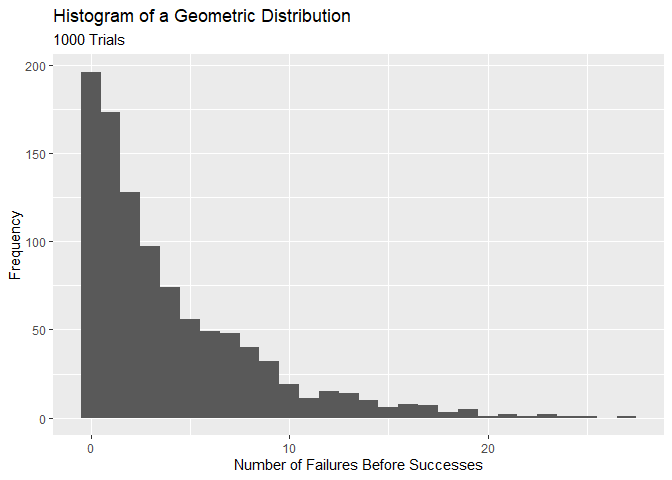

Formative Assessment 6
================
Zion John Yousef T. Ramilo
2024-02-25

I. Geometric Distribution. Provide an R code for the geometric
distribution. The geometric distribution is a probability distribution
that models the number of trials required to achieve the first success
in a sequence of Bernoulli trials, where each trial has a constant
probability of success.

1.  Set the probability of success: p \<- 0.2
2.  Generate 1000 random variables from the geometric distribution.

``` r
geom_dist <- rgeom(1000,0.2)
geom_dist_df <- data.frame("n_failures_before_success" = geom_dist)
head(geom_dist_df)
```

    ##   n_failures_before_success
    ## 1                         2
    ## 2                         0
    ## 3                         0
    ## 4                         0
    ## 5                         0
    ## 6                         4

``` r
tail(geom_dist_df)
```

    ##      n_failures_before_success
    ## 995                          9
    ## 996                          4
    ## 997                         10
    ## 998                         11
    ## 999                          1
    ## 1000                         5

3.  Calculate some basic statistics:

- mean_x \<- mean(x)
- var_x \<- var(x)
- sd_x \<- sd(x)

4.  Print the results in item 3 with the following output (string):

- Number of trials required to achieve first success:
- Mean (in 2 decimal places):
- Variance (in 2 decimal places):
- Sandard deviation ( in 2 decimal places):

``` r
geom_dist_df_summary <- geom_dist_df %>% 
  summarize("Mean" = round(mean(n_failures_before_success),2),
            "Variance" = round(sd(n_failures_before_success),2),
            "StandardDiviation" = round(var(n_failures_before_success),2))
first_row <- paste("Number of trials required to achieve first success: ",1000)
second_row <- paste("Mean (in 2 decimal places): ",geom_dist_df_summary$Mean)
third_row <- paste("Variance (in 2 decimal places):",geom_dist_df_summary$Variance)
fourth_row <- paste("Standard deviation ( in 2 decimal places):",geom_dist_df_summary$StandardDiviation)
cat("\n",first_row, "\n", second_row, "\n", third_row, "\n", fourth_row, "\n")
```

    ## 
    ##  Number of trials required to achieve first success:  1000 
    ##  Mean (in 2 decimal places):  4.04 
    ##  Variance (in 2 decimal places): 4.45 
    ##  Standard deviation ( in 2 decimal places): 19.79

5.  Plot the histogram of the results.

``` r
ggplot(data = geom_dist_df,mapping = aes(x=n_failures_before_success))+
  geom_histogram(binwidth = 1)+
    labs(x="Number of Failures Before Successes",
         y="Frequency",
         title = "Histogram of a Geometric Distribution",
         subtitle = "1000 Trials")
```

<!-- -->
II. Hypergeometric Distribution. Consider a plant manufacturing IC chips
of which 10% are expected to be defective. The chips are packed in boxes
for export. Before transportation, a sample is drawn from each box.
Estimate the probability that the sample contains more than 10%
defectives, when:

``` r
hypergeom_prob <- function(success,n_success,n,N){
  M <- success
  L <- N-M
  x <- n_success
  x_ <- n-x
  numerator <- choose(M,x) * choose(L,x_)
  dinominator <- choose(N,n)
  probability <- numerator / dinominator
  return(probability)
}
```

1.  A sample of 10 is selected from a box of 40;

``` r
estimated_success_40 <- 40*0.1
popu_40 <- 1-hypergeom_prob(estimated_success_40,1,10,40)
```

2.  A sample of 10 is selected from a box of 5000.

``` r
estimated_success_5000 <- 5000*0.1
popu_5000 <- 1-hypergeom_prob(estimated_success_5000,1,10,5000)

cat("\n","Estimated the probability that more than 10% of the sample is defective from a population of 40: ",popu_40, "\n","Estimated the probability that more than 10% of the sample is defective from a population of 5000: ", popu_5000)
```

    ## 
    ##  Estimated the probability that more than 10% of the sample is defective from a population of 40:  0.5557501 
    ##  Estimated the probability that more than 10% of the sample is defective from a population of 5000:  0.6121916
